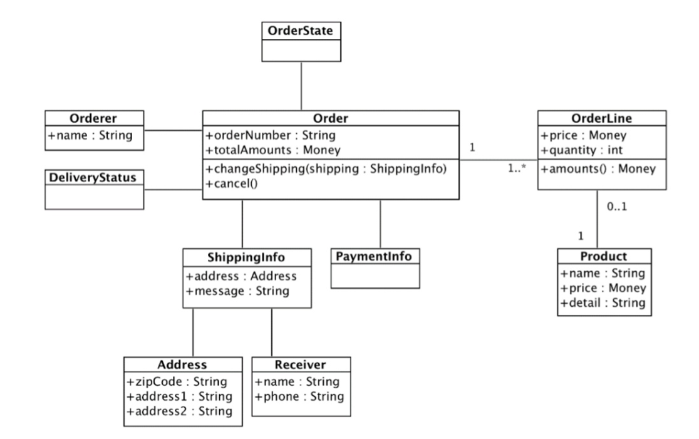
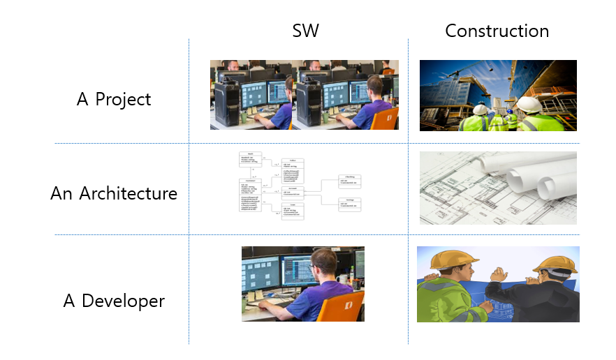
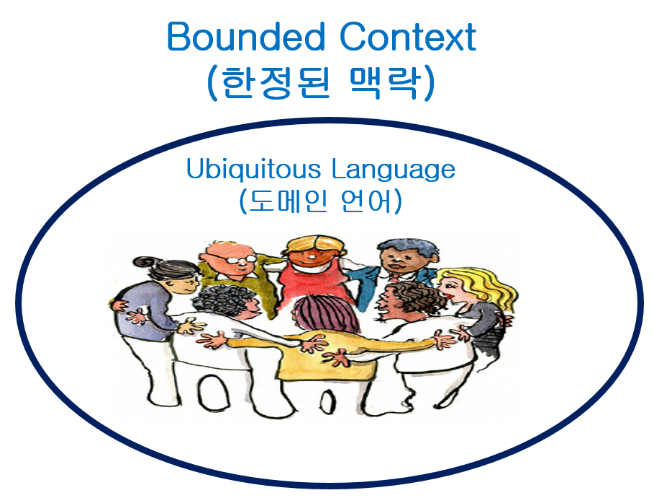
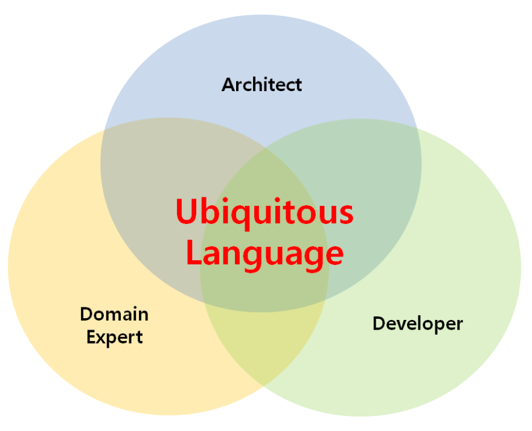

# Domain-Driven Design Learning

## MSA analysis method – DDD(Domain Driven Design)

## DDD outline

The reason software development is difficult begins with the complexity of the business. The intrinsic complexity of what a developer wants to implement in software is greater than the complexity of implementing it.
 
Therefore, it is important for multiple stakeholders to understand the domain in the same way and share domain knowledge through a model that conceptually expresses a specific domain centered on the communication between the experts and developers in the field who understand the work best. Domain Driven Design is the idea that customer requirements should be designed flexibly with a model, and implementation should be connected naturally from this model.
 
At this time, the most important point is that multiple subdomains should not be modeled on one single diagram, and models should be created separately for each subdomain. This is because the meaning of each component of the model becomes clear only when it is limited to a specific domain.

### ·	domain model

A domain model is a conceptual representation of a specific domain. For example, the order domain of the shopping mall selects the quantity of products to order from the shopping mall and inputs delivery address information. Calculate the payment amount with the selected product price and quantity and select the payment method.
 
Even after placing an order, you can change the shipping address or cancel the order as long as it is not delivered. If this order domain is configured as an object model, it is as follows.
 
> 

The figure above is a domain model using objects. To understand a domain, it is necessary to understand the functions it provides and the organization of key data in the domain. In this respect, object models are suitable for modeling domains.
The above object model does not contain all the contents of the domain, but if you look at this model, you can see that an order has an order number and a total amount to be paid, and you can change the shipping information. You will also notice that you can cancel your order. In other words, using a domain model helps multiple parties to understand the domain in the same way and share domain knowledge.
These domains are made up of a number of subdomains. Since the areas covered by each subdomain are different, even the same term may have different meanings for each subdomain. For example, if a product in the product domain means 'information' containing details such as product price, product image URL, and stock quantity, the product in the delivery domain means 'physical product' that is actually delivered to customers. .
Multiple subdomains should not be modeled in one single diagram, as each domain determines the meaning of a term. If the product and the delivery domain model are not distinguished and displayed together in one diagram, it is difficult to understand whether the ‘product’ shown in the diagram is a product in the product domain or a product in the delivery domain.
Since the meaning (Context) is only complete when each component of the model is bounded by a specific domain, the boundary where the meaning of 'product' is used should be divided into Boundary Definition and then domain models should be built separately within the boundary.

---

### ·	Bounded Context (limited context)

**Domain Model and Boundaries**

The product in the product domain, the product in the shipping domain, and the product in the ordering domain have the same name but have different meanings. If product information such as product image, product name, product price, and detailed product description is the main focus of the product in the product domain, the product in the order domain is the object to be ordered, and the product in the delivery domain is the physical product delivered to the customer. indicates. In addition, a physically single product in the product domain may exist in plurality in the order and delivery domain.
Although logically they appear to be the same entity, different subdomains sometimes use different terms. A person who uses the system is called a member in the member domain, but is called an orderer in the ordering domain, and a sender in the delivery domain.
Examples of the same terms in the SW domain and the architecture domain, but with different meanings within the two domains. 'Project' is the process of constructing a building necessary for a person's residence or livelihood.
The term 'architecture' also refers to diagrams such as server, network, software configuration diagrams or ERD and UML in the SW domain, but 'architecture' in the architectural domain refers to design drawings such as floor plans required for building construction.

> 

As such, it is impossible to accurately represent all subdomains with one model because even the same terminology has different meanings for each domain and terms referring to the same object may be different.
 
At this time, since the meaning of the model weakens when several subdomains start to mix, it is important that each model has an explicitly distinct boundary so that they do not mix with each other.

**Bounded Context**

A model has a complete meaning that can be accurately distinguished within a specific boundary context, and the boundary divided in this way is called a Bounded Context in DDD.
 
In other words, a bounded context is a boundary that expresses the scope of the same context, and within that boundary, the model has a specific meaning and performs a specific task.
 
A bounded context determines the boundaries of a model, and a bounded context logically has one or more than one model.
 
Bounded contexts can be distinguished based on the language used by domain members. With respect to the terms 'product' and 'member' of the shopping mall, the order/payment domain and the delivery domain each have different meanings, so the two domains are separated into different contexts.

> 

Since the bounded context becomes a boundary that distinguishes domain models, the bounded context includes a model suitable for the subdomain to implement. Even for the same product, the ‘product’ in the product-bound context and the order-bound context has a model suitable for each context.

### ·	Ubiquitous Language (domain language)

Various stakeholders exist within the bounded context, which is the boundary that separates the domain model. A domain expert who is proficient in domain work, an architect who builds a framework that can be developed, and a developer who builds an actual sub-domain service can be included, and they have all the authority of each sub-domain in charge.

> 
  
A universal language necessary for smooth communication is used between members belonging to each domain, which is called a domain language or ubiquitous language.
 
In other words, a domain language commonly used among collaborating members within a bounded context, a bounded context, is a ubiquitous language.
 
If these domain languages are not universal, domain experts may not understand the terms used by developers, which incurs additional costs for domain experts to understand.
  
  ---
  
> 

When members use their own language, it is difficult to communicate, so the words spoken by the other party must be translated into the words used by the members to understand them.
 
Bounded context boundaries can be maintained soundly when a consistent language is used not only for communication, document writing, but also for code development in consistent terms from communication, event storming, domain modeling, and program development.

## Event Storming for DDD Implementation

Event Storming is a compound word of Event and BrainStorming, and is a methodology in which domain experts and development experts gather together and proceed in the form of a workshop. Among DDD methodologies, it is the most optimal approach to implement MSA because it can be performed without complex UML diagrams or tools.
 
Event storming is a technique for analyzing events occurring in the system based on Event-First, and it is particularly advantageous for quick understanding of the domains required from analysis to development of non-blocking, event-driven MSA-based systems.
 
The existing use case or class diagramming method was a method of refining requirements through customer interviews and recognizing entity structures through detailed design, but event storming can be performed without any pre-trained knowledge and tools.

> 

The process is a participant workshop method, and the result remains as sticky notes are pasted on the wall, and business processes are derived through the connection of orange sticky notes, which can then be refined and converted into BPMN and UML.