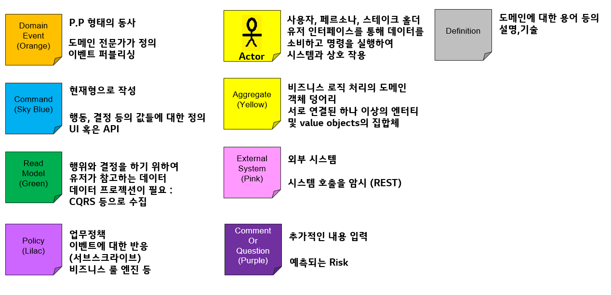
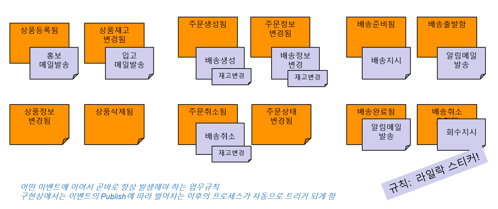
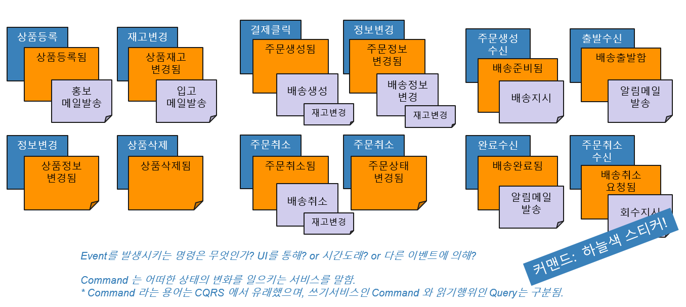
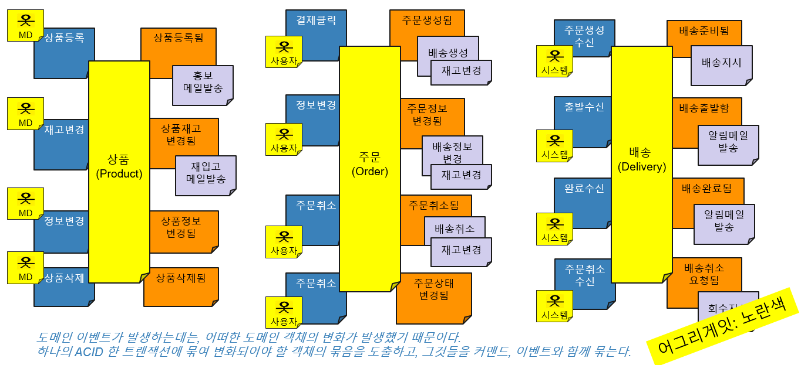
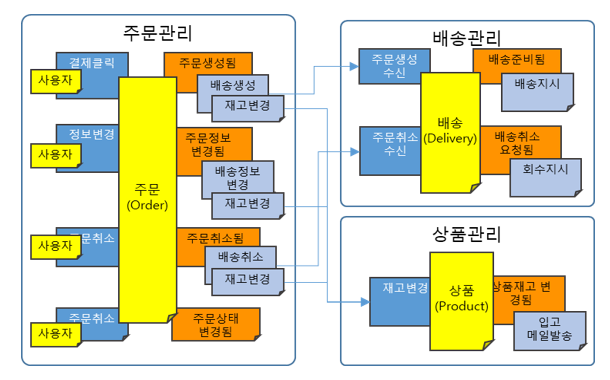
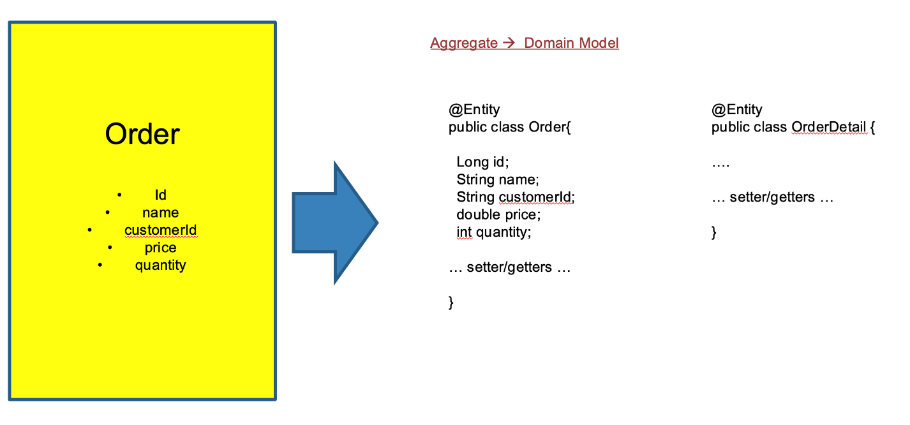
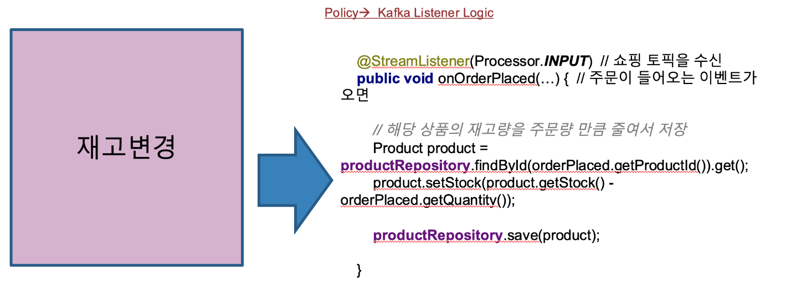

# 이벤트스토밍 학습
# 오프라인 이벤트스토밍(Event-Storming) 기반 MSA 개발

## 개념

이벤트스토밍은 도메인에 관련된 모든 이해 관련자가 모여, 화이트보드 벽면에 주요 이벤트(Event)를 중심으로 업무들 간의 상호
연관성을 찾기 위해, 유일한 도구인 스티키 노트(Sticky Notes)로 진행하는 MSA DDD를 위한 워크숍 기반 최상의
실천 방법론이다.

## 수행 방법
> 

1.  이벤트스토밍에 필요한 화이트 보드 벽면과 수행에 필요한 오렌지, 라일락, 스카이블루, 노랑, 초록, 퍼플, 분홍색의 스티커를 준비한다.  
      
2.  Domain expert 와 기획자, 개발 전문가와 함께 사용자 시나리오, 또는 업무 요건을 리뷰한다.

3.  가장 먼저, 발생 가능한 Event 를 무작위로 도출하고, Policy, Command, Aggregate 순서로 이벤트를
    중심으로 스티커별 해당 내용을 정의하고 발생시간 순서로 벽면에 부착한다.

4.  Bounded Context 를 설정하고 서브 도메인 간의 컨텍스트 매핑을 통해 BC간의 정보 참조의 릴레이션을 정의한다.

### 스티커 유형

이벤트스토밍에 필요한 스티커 색상별 내포하는 의미는 아래와 같다.

> 
> 
그림 1 이벤트스토밍에 사용되는 스티커 유형 및 설명

#### Event (Orange Sticker)

가장 먼저 우리 서비스에서 발생하는 비즈니스 이벤트를 도출한다. 용어의 네임스페이스를 구지 나누려 하지 말고 가급적 현업이
사용하는 용어를 그대로 사용(Ubiquitous Language)하여 오렌지색 스티커에 이벤트를 기술하여 이를
벽면에 붙인다.

비즈니스 이벤트는 과거형으로 작성하는데 도메인 내부에 상태가 변화되고 난 결과가 이벤트 이다.

> 
> 
그림 2 Event 예시

#### Policy (Lilac Sticker)

이벤트스토밍의 두번째 수행 대상은 폴리시(Policy) 도출이다.

폴리시(Policy)는 이벤트가 발생한 후 연이어 발생하는 반응형 액션으로, 한 서비스 이벤트에 대해 수행되어야 할 타 서비스의
액션들로, 먼저 정의된 이벤트 아래에 덧대어 붙인다. 하나의 이벤트에 반응하여 수행되어야 할 폴리시는 여러 팀에서 도출된 멀티
액션이 존재할 수 있다.

> 
> 
그림 3 Policy 예시

#### Command (Blue Sticker)

세번째로 Event를 발생시키는 행위인 커맨드를 도출하는데, 도메인 내의 어떠한 상태 변화를 일으키는 서비스를 말한다. 웹 페이지
내에서 버튼을 클릭하는 User Decision이 여기에 해당된다. 도출된 커맨드는 이벤트 스티커 앞쪽에 붙여, 스티커를 통한
나레이션(Narration)이 되도록 정렬한다.

> 
> 
그림 4 Command 예시

#### Actor (Yellow Sticker)

Actor는 커맨드를 발생시키는 주체(사람, 시스템, 등)를 말한다. 액터는 담당자 또는 시스템이 될 수 있으며, 직관적으로
파악될 수 있는 액터의 경우, 표시하지 않아도 무방하다. 도출된 액터는 유저 스토리에 가까운 나레이션이 가능하도록 해당
커맨드 스티커 왼쪽에 배치한다.

> 
> 
그림 5 Actor 예시

#### Aggregate (Yellow Sticker)

 다섯번째로, 어그리게잇을 도출한다. 어그리게잇은 ‘결합물’을 의미하는데 어떠한 도메인 객체를 중심으로 하나의 ACID한
 트랜잭션에 묶여 변화되어야 할 객체의 묶음을 도출하고, 그것들을 커맨드, 이벤트와 함께 묶는다.

> 
> 
그림 6 Aggregate 예시

### Bounded Context 도출

Bounded Context는 동일한 문맥으로 효율적으로 업무 용어(도메인 클래스)를 사용할 수 있는 객체 범위를 뜻한다. 하나의
BC는 하나 이상의 어그리게잇을 원소로 구성될 수 있다. 이 BC를 마이크로서비스 구성 단위로 정하게 되면 이를 담당하는 팀 내의
커뮤니케이션이 효율화 된다.

> 
> 
그림 7 Bounded Context 예시

### Context Mapping 

바운디드 컨텍스트까지 도출된 이후에 BC간 정보 참조 릴레이션 설정 (혹은, 이벤트가 발생한 이후 동반된 행위의 호출 관계를
선으로 표시)하는 작업을 ‘컨텍스트 매핑’이라고 한다. 컨텍스트간 매핑 정보만 보더라도 전체 도메인 서비스의 참조
토폴로지(Topology)를 한 눈에 파악 가능하다.

> 
> 
그림 8 Context Mapping 예시

위 예시에서 ‘주문이력에 추가’라는 폴리시(비즈니스 업무) 시작 주체에 따라 크게 2가지 토폴로지를 고려할 수 있는데, 이벤트를
발행하는 주체인 주문관리에서 해당 폴리시를 시작하는 ‘오케스트레이션’ 방식과 이벤트를 수신하는 주체인 마케팅관리에서 폴리시를
시작하는 ‘코레오그래피’ 방식으로 구분한다.

#### Orchestration

오케스트레이션은 이벤트를 발행하는 주체인 주문관리에서 모든 폴리시를 호출하는 방식이다.

> 
> 
그림 9 Policy Topology – Orchestration

이는 주문관리 서비스에서 발생한 이벤트인 ‘주문 생성됨’, ‘주문정보 변경됨’, ‘주문상태 변경됨’에 붙여진 모든 폴리시의
Owner 서비스마다 커맨드를 노출하고, 이벤트를 생성하는 주문 서비스에서 이 커맨드를 동기 방식(Request &
Response)으로 호출하는 방식으로 구현된다.

그러나, 이러한 방식은 서비스간 커플링이 높으며, 폴리시를 호출한 서비스(여기서는 주문관리)는 폴리시가 수행 완료될 때까지
대기상태에 빠지게 되므로, 시스템 블로킹(Blocking)이 생길 우려가 높다.

또한, 호출당하는 폴리시를 가진 시스템이 얘기치않은 장애(System Fault)에 빠진 경우, 이를 호출하는 서비스에까지 장애가
전파되는 악순환의 우려가 있다.

#### Choreography

코레오그래피는 폴리시를 구현하는 주체인 배송, 또는 상품관리에서 자율적으로 폴리시를 실행하는 방식이다.

주문관리 서비스에서 발생(Publish)하는 이벤트들에 대해, 폴리시 Owner 서비스들이 관심 있는 이벤트에
반응(Subscribe)하여 자율적으로 서비스를 구동함으로써 Orchestration방식이 가진 서비스간 커플링이 전혀
없으며, 이벤트를 수신하는 신규 서비스의 추가 및 이벤트를 수신하던 기존 서비스의 삭제가 아주 자유롭게 수행 가능하다.

또한, 주문관리 서비스 입장에서도 호출당하는 폴리시를 가진 시스템의 얘기치않은 장애(System Fault)에 대해, 이 방식은
완전히 자유롭다는 것이 가장 큰 장점이다.

> 
> 
그림 10 Policy Topology - Choreography

### 마이크로서비스 구현

#### Hexagonal Architecture

아래와 같은 육각형 모형의 아키텍처 도형을 헥사고날 아키텍쳐라고 한다. 이는 가운데 영역인 비지니스 로직 (도메인 영역) 을
손상시키지 않고 프로그램을 구성하도록 고안된 아키텍처이다. 비지니스 로직을 손상시키지 않고 프로그램을 구현하기 위해서는
비지니스 로직에 특정 프로토콜이나 프로그램에 종속적인 코드가 들어가면 안된다. 예를 들어 데이터베이스에 종속적인 Query 를
직접 사용하였다면, 데이터베이스가 변경되는 상황이 발생한다면 해당 로직은 모두 다시 만들어야 한다. 마찬가지로
메세지브로커를 사용하는 경우 특정 브로커의 코드를 직접적으로 사용하면 변경이 생길 때나, 여러 브로커를
사용하는 경우가 생기면, 다시 구현을 해야하는 이슈가 생기게 된다.

이처럼 비지니스 로직은 순수한 형태로 구현을 하고, 그 이외의 것을 adapter 형식으로 설계를 하여 해당 비지니스 로직이 어느
환경에서도 잘 동작하도록 설계한 모형이 헥사고날 아키텍처이고, 마이크로 서비스 아키텍쳐에서는 이와 같은 방식을 지향한다.

> 

#### MSA Chassis

MSA Chassis 라는 말은 마이크로 서비스를 구축할때 필요한 주변 요소들을 일컫는다. 마치 ‘창틀처럼 이것저것 끼워
넣는다’로 해석할 수도 있다. 위에 설명한 헥사고날 아키텍처로 설계를 하여 비지니스 로직에 영향이 없는 개발을
맨땅에서 하려면 많은 공수가 필요하다. 이에 많은 프레임워크들이 이와 같은 패턴들을 구성해 놓고 제공중이다.

Java 계열에서 가장 선두주자인 Spring 프레임워크에서 마이크로 서비스에 적합한 spring-boot 프레임워크를 내어
놓았고, 이에 여러가지 어뎁터들에 해당하는 프로젝트들이 존재한다. 아래 그림은 헥사고날 아키텍쳐에 spring-boot
를 기반으로 한 MSA Chassis 를 입힌 모형이다. Spring-Data-Rest 를 사용하여 Data 를 외부와 Rest
방식으로 연결시키고 , String-Cloud-Stream 으로 메세지 처리를 하는 로직을 구현하여 특정 브로커에 종속적이지
않은 adapter 패턴으로 구현된 모형이다.

> 

#### 이벤트스토밍 스티키 노트별 구현기술 적용

##### Aggregate - Yellow

 * 이벤트 스토밍의 첫번째 구현은 도메인 모델을 정의하는 단계이다.  
    노란색 스티커로 붙여진 Aggregate 의 변화에 의하여 이벤트가 생성되고, 커맨드 요청을 받아서 Aggregate 가
    변화를 하기 때문에, Aggregate 는 가장 중요하고, 가장 먼저 구현을 한다.

 * Aggregate 를 구현 시, Java 언어로 Spring-boot 를 사용하여 구현을 한다면 아래와 같이 Java 클래스에
 @Entity 어노테이션을 선언해 주면 준비가 완료된다.
 
 * Entity 라는 말은 객체 혹은 개체 라는 의미로 사용되는데 연필이나 컴퓨터 처럼 서로 구별이 되는 하나하나의 대상을
 지칭한다. 즉 우리가 사용하는 도메인 언어이다. Spring 에서는 이런 도메인을 손쉽게 사용할 수 있도록
 어노테이션을 제공하여 준다.
 
 * 어노테이션 선언 후에 Entity 구성에 필요한 속성들을 정의하여 주면 된다. 속성들은 java 언어에서는 변수로 선언을
 해주면 된다.
 
 * 모든 Entity 는 각 개체마다의 생성되고, 변화되고, 사라지는 lifecycle 을 가지고 있고, 속성이 있기에,
 프로그래밍 언어로 보았을 때 데이터베이스와 API 와의 매칭이 당연시 된다.
 
 * Aggregate 에 포함된 특정 Entity 를 RootEntity 혹은 AggregateRoot 라고 부른다,
 
 * 아래 그림은 노란색의 이벤트 스토밍 스티커인 Aggregate 를 구현한 모습이다.
 
> 

##### Command – Sky Blue

*  Aggregate 를 구성하였으면, 해당 Aggregate 를 변화시키는 커맨드를 작성한다.

*  파란색 스티커에 해당하는 Command 는 구현관점으로 보았을 때 외부로부터 들어오는 API 에 해당한다.
 
* DDD 에서는 Aggregate 를 변화시키는 채널을 Repository 라고 한다. 그리고 RootEntity 에서만
 Repository 를 제공하라고 한다.
 
* Spring-Data-Rest 에서는 해당 Repository 를 구성하는 방법을 @Repository 라는 어노테이션
 선언하여 구성하거나 혹은 extends Repository 같은 방식으로 구현하도록 guide 되어있다.
 
* Spring-Data-Rest 를 사용하여 Repository Pattern 으로 프로그램을 구현하면 Entity 의
 lifecycle 에 해당하는 기본적인 CRUD 가 바로 생성이 되고, 해당 CRUD 에 해당하는 API (커맨드) 가
 자동으로 생성된다.
 
* Repository Pattern 으로 구성이 안되고 복잡한 비지니스 로직이 있으면 Spring 에서 MVC 패턴으로 나온
 Controller 와 Service 로 구현하면 된다
 
* 아래는 파란색 스티커인 커맨드를 구현한 코드이다.
 
> 

##### Event - Orange

 * 주황색 스티커인 이벤트는 pojo 객체인 Java Class 로 생성을 한다.

 * 실제로 메세지로 주고 받을 때는 json 객체 형식으로 통신하는 방법을 추천한다. Json 객체를 직접 만들거나, String
 변수처럼 바로 선언을 할 수도 있으나, 클래스 파일로 구성을 해 놓았을 시, 명시적이고 쉽게변경하기 어렵다.

> 

 * 이벤트는 Aggregate 의 변화에 의해서 발생하기 때문에, 이벤트를 보내는 로직은 Entity의 lifecycle 에
    작성을 하게 된다. 물론 비지니스 로직의 중간중간에 이벤트를 발생시켜야 한다면, 따로 서비스에서 처리를 하는 것이
    맞으나, DDD 에서 말하는 주요 문구인 도메인을 보았을 때 비지니스가 보여야 한다는 원칙에 맞추어 Entity
    에서 이벤트를 발생하는 방법을 추천한다.

* JPA 에서는 이러한 Entity 의 lifecycle에 해당하는 listener 를 어노테이션으로 생성하여 놓았다.
대표적으로 @PostPersist (저장후) @PrePersist(저장전) @PostUpdate (업데이트후) 등이 있다.
 
* 메시지를 send 하는 방법은 어떤 라이브러리를 쓰고, 설정에 따라 달라지지만 메시지 브로커를 kafka 를 사용한다면
 topic 을 설정하고, 마지막에 send 하는 형식으로 이벤트를 발행한다.
 
> 

##### Policy - Lilac

* 보라색 스티커는 이벤트에 반응하여 작동하는 Policy 이다. 이벤트에 반응하기 때문에 이벤트를 수신하는 리스너가
    필요하다. Spring-cloud-Stream 을 사용시 아래처럼 @StreamListener 어노테이션으로
    선언을 하여 주면, 이벤트가 생성될 때마다 INPUT 으로 들어오는 데이터를 한 개씩 수신이 된다.

* Processor.INPUT 은 메시지를 수신하는 채널인데, kafka 의 구현체를 가진다면 topic 을 의미한다. 만약
 Topic 을 여러 이벤트에서 공유를 한다면 아래 리스너에서 내가 원하는 이벤트만 선별하여 작업을 해야하기 때문에 이벤트의
 속성값에서 정해진 이벤트 명을 찾던가, header 에서 찾는 등 이벤트를 구분하는 로직이 필요하다.
 
> 

##### Bounded Context

* 이벤트 스토밍을 하고 난 후에 여러 Aggregate 들이 관련된 Context 끼리 묶여서 Bounded Context
    가 형성이 된다. 이것은 마이크로 서비스 단위로 쪼갤 수 있는 후보가 된다.  
      
* 마이크로 서비스는 java 언어로 구현 시 가장 적합한 프레임워크는 Spring-boot 이다. 내장된
    톰켓(Tomcat)으로 자체 서버를 띄울 수 있고, 라이브러리를 추가하는 방식으로 Chassis 구성을 손쉽게
    할 수 있다.
