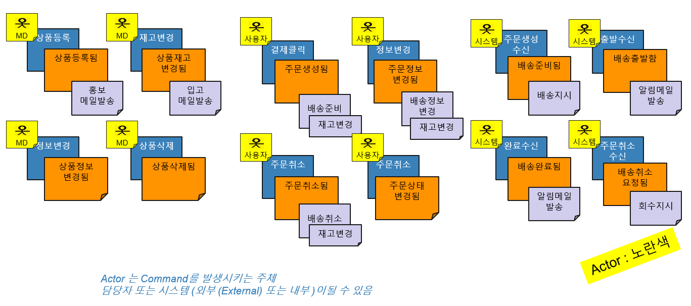
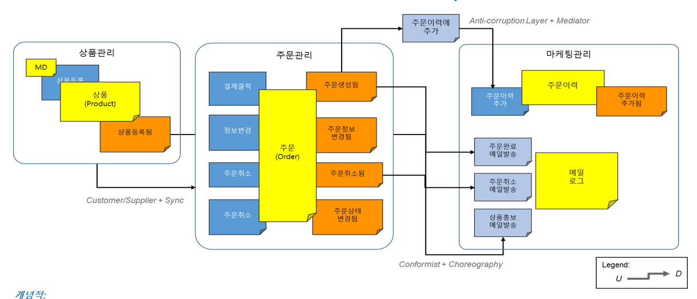
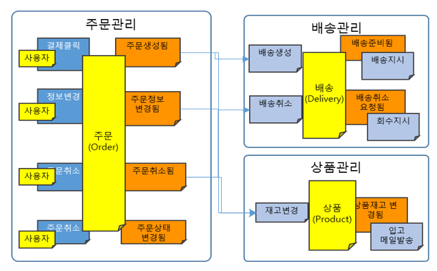
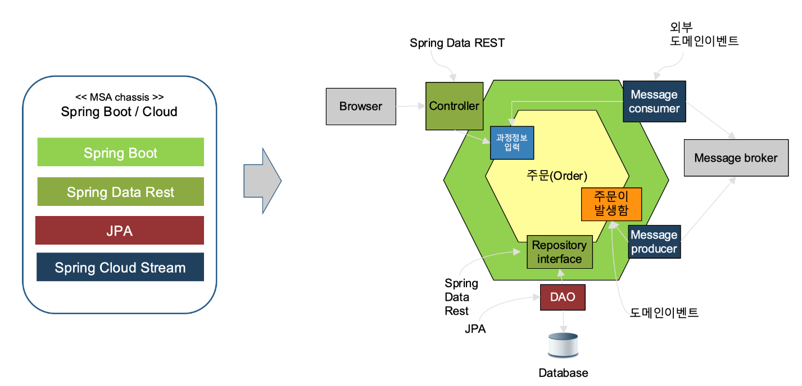
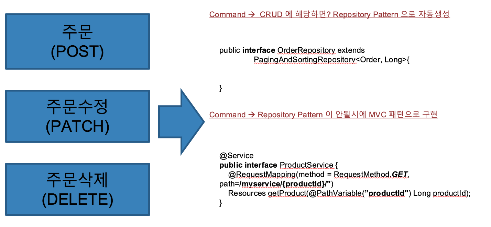
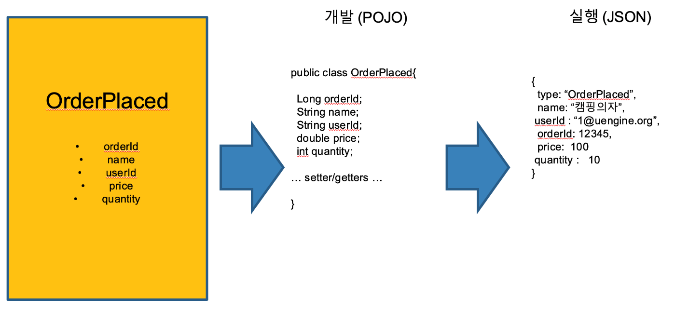

# Event Storming Learning
# Offline Event-Storing based MSA development

## Concept

Event Storming is a workshop for MSA DDD that is conducted with Sticky Notes, the only tool in which all stakeholders related to the domain gather and find correlations between tasks centered on major events on the whiteboard wall. It is based on best practice methodology.

## How to do it
> 

1. Prepare the white board wall needed for event storming and stickers of orange, lilac, sky blue, yellow, green, purple, and pink for the performance.
2. Review user scenarios or business requirements with domain experts, planners, and development experts.
3. First, randomly deduce possible events, define the contents of each sticker centered on the events in the order of Policy, Command, and Aggregate, and attach them to the wall in the order of occurrence time.
4. Set Bounded Context and define the relation of information reference between BCs through context mapping between subdomains.

## Sticker type

The meaning of each sticker color required for event storming is as follows.

> 

### · Event (Orange Sticker)

First, we derive business events that occur in our service. Do not try to divide the namespace of terms, but use the terms used in the field as it is (Ubiquitous Language), describe the event on an orange sticker and stick it on the wall.
 
A business event is written in the past tense, and the result of a state change in the domain is an event.

> 

### · Policy (Lilac Sticker)

The second target of event storming is policy derivation.
 
A policy is a reactive action that occurs one after another after an event has occurred. Actions of other services to be performed for one service event are added below the previously defined event. A policy to be performed in response to one event may have multiple actions derived from multiple teams.

> 

### · Command (Blue Sticker)

Third, it derives a command, which is an action that generates an event, and refers to a service that causes any state change in the domain. An example of this is a User Decision that clicks a button within a web page. The derived command is pasted on the front of the event sticker and arranged to be narration through the sticker.

> 

### · Actor (Yellow Sticker)

Actor refers to the subject (person, system, etc.) that generates the command. An actor can be a person in charge or a system, and in the case of an actor that can be intuitively identified, it is not necessary to display it. The derived actor is placed on the left side of the command sticker to enable narration close to the user story.

> 

### · Aggregate (Yellow Sticker)

Fifth, we derive aggregation. Aggregate means ‘combination’, which is tied to one ACID transaction centered on a certain domain object, derives a bundle of objects to be changed, and binds them together with commands and events.

> 

### · Bounded Context deduction

Bounded Context refers to the scope of objects that can efficiently use business terms (domain classes) in the same context. A BC may consist of one or more aggregated elements. If this BC is set as a microservice unit, communication within the team in charge of it is streamlined.

> 

### · Context Mapping 

After the bounded context is derived, the operation of establishing an information reference relation between BCs (or displaying the call relation of the accompanying action after the event occurs as a line) is called ‘context mapping’. It is possible to grasp the reference topology of the entire domain service at a glance by looking only at the mapping information between contexts.

> 

In the example above, two topologies can be considered depending on the entity that initiates the policy (business work) of 'add to order history'. It is divided into a 'choreography' method that starts policy in marketing management, which is the subject of

## Orchestration

Orchestration is a method of calling all policies in order management, the subject that issues events.

> 

It exposes commands to every owner service of all policies attached to the events 'order created', 'order information changed', and 'order status changed' that occurred in the order management service, and synchronizes this command in the order service that creates the event ( Request & Response) is implemented as a method of calling.
 
However, in this method, the coupling between services is high, and since the service that called the policy (here, order management) falls into a waiting state until the policy is completed, there is a high risk of system blocking.
 
In addition, when a system having a policy being called falls into an unspoken fault (System Fault), there is a risk of a vicious cycle in which the fault is propagated to the calling service.

## Choreography

Choreography is a method of autonomously executing policies in delivery or product management, which is the subject of policy implementation.
 
For events that occur (publish) in the order management service, policy owner services respond (subscribe) to events of interest and operate services autonomously, so there is no coupling between services in the orchestration method at all, and new Addition of services and deletion of existing services that have received events can be performed very freely.
 
Also, from the point of view of the order management service, the biggest advantage is that this method is completely free from system faults that have a policy being called.

> 

## Implementing microservices

<h4>Hexagonal Architecture</h4>

The architectural figure of the hexagonal model as shown below is called a hexagonal architecture. It is an architecture designed to compose programs without breaking the middle area, the business logic (domain area). In order to implement the program without damaging the business logic, code dependent on a specific protocol or program should not be inserted into the business logic. For example, if a database-dependent Query is used directly, if a database change occurs, all the logic must be re-created. Similarly, when using a message broker, if a specific broker's code is directly used, when a change occurs or when multiple brokers are used, an issue of re-implementation arises.
 
In this way, the business logic is implemented in a form as it is, and the other business logic is designed in an adapter format so that the business logic works well in any environment.

> 

<h4>MSA Chassis</h4>

The term MSA Chassis refers to the surrounding elements needed by microservices when it is building. It can also be interpreted as ‘putting things in like a window frame’. A lot of work is required to design with the hexagonal architecture described above and develop without affecting business logic on the ground. For this reason, many frameworks have configured and provided such patterns.
 
The spring framework, the leader in Java technologies, has released the spring-boot framework suitable for microservices, and there are projects corresponding to various adapters. The figure below is a model coated with MSA Chassis based on spring-boot on a hexagonal architecture. It is a model implemented with an adapter pattern that is not dependent on a specific broker by implementing the logic to connect data with the outside in the Rest method using Spring-Data-Rest, and to process messages with String-Cloud-Stream.

> 

### · Application of implementation technology for each sticky note in event storming

### · Aggregate - Yellow

* The first implementation of event storming is defining the domain model.
Because an event is generated by the change of the Aggregate marked with a yellow sticker, and the Aggregate changes by receiving a command request, Aggregate is the most important and implemented first.

* When implementing Aggregate, if you implement it using Spring-boot in Java language, you need to declare @Entity annotation on the Java class as shown below to complete the preparation.

 
* The word Entity is used in the sense of object or entity, and refers to each distinct object, such as a pencil or a computer. That is, the domain language we use. Spring provides annotations so that you can use these domains easily.

 
* After the annotation declaration, you can define the properties necessary for Entity configuration. Attributes can be declared as variables in the java language.

 
* Every entity has a lifecycle of creation, change, and disappearance for each entity, and since it has properties, matching with the database and API is taken for granted when viewed from a programming language.

* A specific Entity included in Aggregate is called RootEntity or AggregateRoot.
 
* The figure below shows the implementation of the yellow event storming sticker, Aggregate.

 
> 

### · Command – Sky Blue

*  After configuring the aggregate, write a command to change the aggregate.

*  Command corresponding to the blue sticker corresponds to the API coming from the outside from the implementation point of view.

 
* In DDD, the channel that changes the aggregate is called the Repository. And it tells to provide Repository only in RootEntity.

 
* In Spring-Data-Rest, the method of configuring the relevant Repository is guided by declaring the annotation @Repository or implementing it in the same way as extends Repository.

 
* When a program is implemented in Repository Pattern using Spring-Data-Rest, a basic CRUD corresponding to the lifecycle of an entity is created immediately, and an API (command) corresponding to the CRUD is automatically created.

 
* If it is not configured with Repository Pattern and there is complex business logic, you can implement it with Controller and Service from MVC pattern in Spring.

 
* Below is the code that implements the command, which is a blue sticker.

 
> 

### · Event - Orange

* The orange sticker event is created as a Java Class which is a POJO object.

*  In fact, when sending and receiving messages, it is recommended to communicate in a JSON object format. You can create a JSON object directly or declare it directly like a String variable, but when it is configured in a class file, it is difficult to change it explicitly and easily.

> 

* Since the event is generated by the change of the Aggregate, the logic for sending the event is written in the lifecycle of the Entity. Of course, if you need to generate an event in the middle of the business logic, it is correct to handle it separately in the service, but in accordance with the principle that the business should be visible when you see the domain, which is the main phrase in DDD, we recommend the method of generating the event in the entity.

* In JPA, listeners corresponding to the lifecycle of these entities are created as annotations. Typical examples include @PostPersist (after saving), @PrePersist (before saving), and @PostUpdate (after updating).

 
* The method of sending a message depends on which library is used and the configuration, but if kafka is used as the message broker, the topic is set and the event is issued in the form of sending at the end.

 
> 

### · Policy - Lilac

* The purple sticker is a policy that works in response to an event. Because we are reacting to events, we need a listener to listen to them. When using Spring-cloud-Stream, if you declare it with @StreamListener annotation as shown below, each time an event is generated, incoming data to INPUT is received one by one.

* Processor.INPUT is a channel to receive messages, and if it has an implementation of kafka, it means topic. If the topic is shared by multiple events, the listener below needs to select and work on only the desired event, so logic is needed to classify events, such as finding the event name specified in the event attribute value or finding it in the header.

 
> 

### · Bounded Context

* After event storming, several aggregates related contexts are grouped together to form Bounded Context. This makes it a candidate for breaking down into microservices.

      
* When implementing microservices in java language, the most suitable framework is Spring-boot. You can start your own server with the built-in Tomcat, and you can easily configure Chassis by adding a library.

