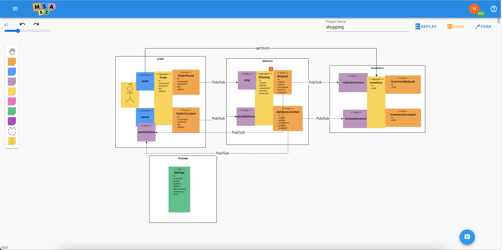
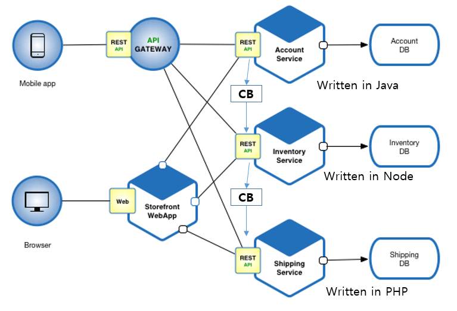
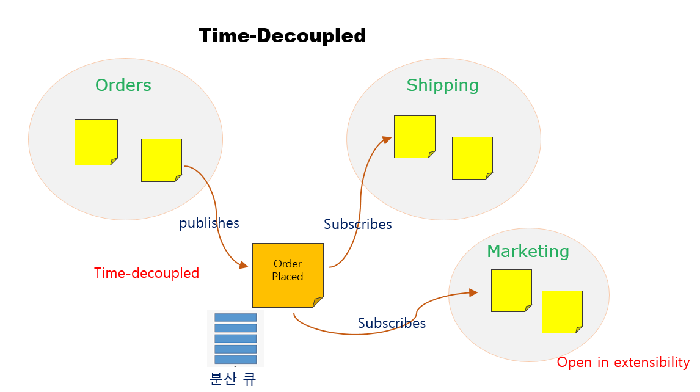
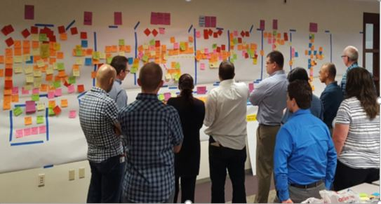

# Introduce

MSA Easy is a tool that supports analysis, design, implementation and monitoring required from microservices construction to operation. It analyzes and designs domains through event-storming-based collaboration, and automatically generates MSA source codes based on the designed domain model. 

It provides a modeling environment of the event-driven domain analysis technique that is recently adopted by global companies which are leading MSA such as IBM and Pivotal, and it provides and creates MSA template code and files necessary for cloud deployment at the same time so that developers can focus more on implementing business logic from the modeling. 

> 

'Event Storming' is a compound word of Event and BrainStorming, and it is a technique that can speed up the design and development of event-based systems. Even if you do not have IT expertise in UML or BPMN, business professionals, business experts, and domain experts can gather together at one place to design a model with only stickers centered on major events on the whiteboard wall.
 
Actions that trigger an event (user’s decision-making) and actions that respond to the event are modeled visually by 1) all stakeholders, 2) within a short period of time, and 3) visually. Ultimately, it can be used to break up a service into multiple pieces to be microservices.
 
MSA Easy compensates for the space constraints of offline event storming and the fact that the sticker on the wall of the whiteboard can easily fall off due to physical factors.
 
In addition, unit microservice code generation is possible through the forward engineering function of the resulting model, and automated configuration files required for the cloud environment in which the microservice will be operated on such as Docker file, CI (Continuous Integration), and CD (Continuous Deployment) pipelines can also be created.
 
MSA Easy's custom template provides extended functions that can be used to customize templates to fit into a standard framework of a company that applies it. 

--- 

## main Features

  - **Web-based Event Storming environment**
    
      - 6 types of Event Sticker  
        (Event, Policy, Command, Aggregate, External System, Read Model)    
      - Bounded Context and Context Mapping (Relation between Microservices)    
      - English word suggestion    

  - **Code Generation**    
      - MSA Implementation Source Codes (Default: Spring-boot)    
      - Dockerfile    
      - Pipeline YAML file for CI/CD DevOps    
      - Helm Chart for Kubernetes Deployment
      
  - **Custom Templates for Microservice’s Polyglot language**    
      - Template customizing support (Any language is available)    
      - Local and remote(Github) template add-in support

---

## Background and purpose of the tool

### ·	EDA(Event Driven Architecture)
<h3> ·	A trend of EDA (Event Driven Architecture) based 3rd generation</h3>

It is reality that Monolithic architecture needs more time for continuous delivery process due to a high dependency on mutual modules in a large distribution unit and it also uses a single DB, so even when minor improvements are required to be applied, more extra time is required because of compliance with standard guidelines and obtaining approval procedures through complex payment lines.
 
Moreover, in order to survive in the fiercely competitive market, agile approach is required to identify whether customers are actually interested in the products through rapid release to markets and if customers are really interested in the products, matured products can actually be released into the markets through Fail Fast and Fail Cheap strategies.
 
There was SOA(Service Oriented Architecture) to maximize productivity by abiding by well-designed API and schemas and retrieving common services and reusing them. However, standardization in the business lifecycle, which requires quick and agile acceptance and reflection of requirements, is rather a big obstacle that hinders the voluntary productivity of each team.
 
So, microservices architecture emerged. Microservices are similar to SOA in terms of providing services implicitly (Implementation Hiding), but it is largely different from SOA in that they thoroughly separate not only the service level but also the database level.
 
Early microservices were designed with an architecture that allows service autonomy and independence, and selection of storage (Polyglot Persistence) optimized for services, but time coupling (Request & Response) is mainly used when calling between services. Time Coupling was a main weakness for early microservices.
 

> 

 The 3rd generation MSA based on Event(EDA) which has recently been in the spotlight was introduced to improve the first generation MSA and it follows the architecture of intercommunicating through Pub/Sub between microservices that broadcast events occurring in the domain through queues.

> 

For example, when an order is placed, it is not important for the ordering team to directly instruct the delivery team to ‘prepare delivery’. The ordering team is not interested in whether the delivery team delivers or not.
 
When communicating with each other in the REST method (direct call), blocking, that is, time coupling occurs, in which the requestor must wait until a response arrives to perform the next action.
 
If the order team has an asynchronous based queue (single Source Of Truth) for the fact that it has occurred, “Order has occurred.” , and the delivery team can carry out the following actions on their own. The architecture of this pattern of “reporting what has happened” and “subscribing to the reported facts” is called Event Driven (or whiteboard pattern).
 
Then, in the first-generation MSA, the delivery team's business process was called and executed by the ordering team, and in the third-generation MSA, the execution subject is changed because the delivery team directly responds to the event.
 
If there is a business process to be performed due to the creation of order by ordering team, Marketing team which is newly organized only needs to perform actions properly for the event as a response.
 
also, if there is a business process to be performed due to the ordering team's order creation, simply "Order has been sent" from the ordering team. The marketing team should also react to the event.
 
This tool is a support tool for you to derive EDA-based MSA and develop services easily even if it is unfamiliar.

 
### ·	Trend of Event Storming Agile Technique
 
The event storming which is required for building an event-based 3rd generation MSA  needs a collaborative space for business, business professionals, and domain experts to analyze and design interrelationships between tasks.
 
In proportion to the size of the service, a larger and wider collaboration space and the corresponding space must be occupied until the event storming is finished.

> 

however, when you use MSA Easy, a space and time constraints will be eliminated because business performer, domain experts and system developers are able to use online whiteboard based on web browser for collaboration.
 
In addition, there is no risk of loss or damage to the sticky note even if the event storming is performed for 2 hours every day for 2 to 3 weeks, and the results are also electronically managed automatically.

### ·	Auto creation of MSA code

In an offline eventstorming environment, developers must manually write codes by referring to the eventstorming result model. Coding is entirely up to the developer within the team, and the number of development targets increases as the number of stickers increases. Moreover, if the developer is unfamiliar with event-based MSA coding, the learning curve on how to start can become an unpredictable bottleneck.
 
In the case of a web scale-based service, using a language optimized for service implementation is advantageous in that it increases server-side performance and reduces the user's response time.
 
MSA Easy automatically generates MSA source code in the polyglot language set by the developer for the event storming results. The result performed through the tool is generated as MSA source code through the Forward Engineering code generation module, and through a user-definable extension template, it is supported to apply a language optimized for each MSA service.
 
In addition, it automatically generates a Dockerfile for cloud distribution based on the Workload Distribution Engine, a CI/CD pipeline, and a Helm Chart script to easily create MSA in the container runtime environment.
 
By using this tool in this way, it is possible to reduce the hassle of manually writing not only MSA source code but also meta information (Configuration) required for cloud operation by DevOps personnel.

### ·	User-defined templates for Polyglot MSA

In the case of simple monolithic applications in the past, only two application servers and DB servers need to be managed, but in MSA, basically, only one service is executed per server, so it is possible to apply as many heterogeneous instance servers as there are services and databases optimized for each service. do. That is, every service does not necessarily have to be composed of the same development language and the same framework.
 
For example, MSA services with high TPS (transactions per hour) and read operations are implemented based on Node and Redis, and Spring and RDB can be applied to MSA services where transaction and stability are important. We call this ‘Polyglot Architecture’.
 
MSA Easy supports template-based MSA code generation features to support this polyglot architecture. By utilizing the custom template function of MSA Easy, the developer adds a template in addition to the built-in template so that the EventStorming result can be generated according to the desired template.

[Details of custom templates are described in Ch4.3 Custom Templates.](../templates-language/custom-template)

---

## Effectiveness

The ES2Cd tool retains the advantages of the DDD implementation methodology called EventStorming, and does not require sufficient spatial elements for event storming, and there is no risk of loss or damage that may occur when a sticker is attached to the wall.
 
In addition, compared to the standard framework-based development of general SI companies, the development of microservices through the event storming tool has several advantages.

| **Section**           | **When applying the standard development methodology**  | **When applying the event storming tool** |
| ----------------- | ----------------------------- | ---------------------- |
|  Ease of analysis and design | Analysis and design personnel understand professional tools (UML, BPM, ERD, etc) and create products using them | From domain experts to UI/UX personnel, developers can analyze and design without any tools |
| system scalability    | Mutual interference increases with DB-level sticky reference (JOIN Query) due to designing the data structure first | Less interference between services by defining individual services after identifying business domains |
| MSA Development Productivity | Manual development by developers with MSA implementation skills | The tool automatically generates the initial source code |
| MSA Code Diversity | Implement all service code in a single language provided by the framework | A user-defined extension template can be created in a language that matches the characteristics of each service |
| Maintenance Flexibility | Constraints exist for SM organizations to understand the standard framework | With the application of ubiquitous language and the application of MSA Chassis for each event-storming sticker, SM is relatively advantageous. |

 Table 2. Effectiveness of introducing Event-Storming tool 

MSA Easy supports the entire MSA lifecycle, from analysis to operation. The source code, which was developed manually by developers with existing MSA skills, is automatically generated by the tool, and version control and electronic storage of results, which are impossible offline, is one of the advantages provided by MSA Easy which is a software-based event storming tool.

---

## Runtime Environment

<table>
<thead>
<tr class="header">
<th>Section</th>
<th>Contents</th>
</tr>
</thead>
<tbody>
<tr class="odd">
<td>Supported OS</td>
<td>Windows, Linux, Mac OS support</td>
</tr>
<tr class="even">
<td>Support Cloud</td>
<td>
All Cloud Platform support

(AWS, GCP, MS Azure, IBM/Oracle Cloud, OpenShift)
</td>
</tr>
<tr class="odd">
<td>Service type</td>
<td>On-Premise, or SaaS</td>
</tr>
<tr class="even">
<td>Required Specifications</td>
<td>512 MB Memory or more</td>
</tr>
<tr class="odd">
<td>Support Browser</td>
<td>Cross-browser support (Except for MS-types such as IE, Edge, etc.)</td>
</tr>
<tr class="even">
<td>Installation Module</td>
<td>None</td>
</tr>
</tbody>
</table>

Table 3. MSA Easy Runtime Environment

