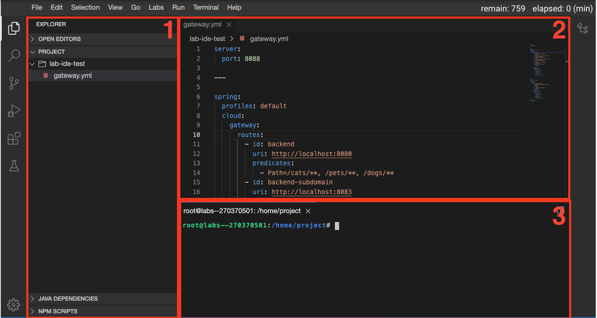
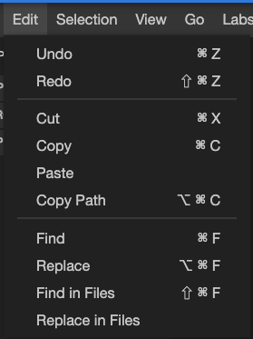
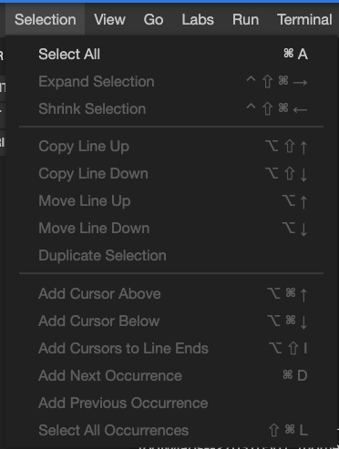
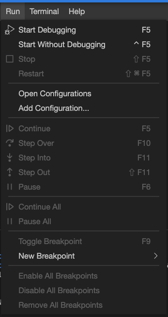
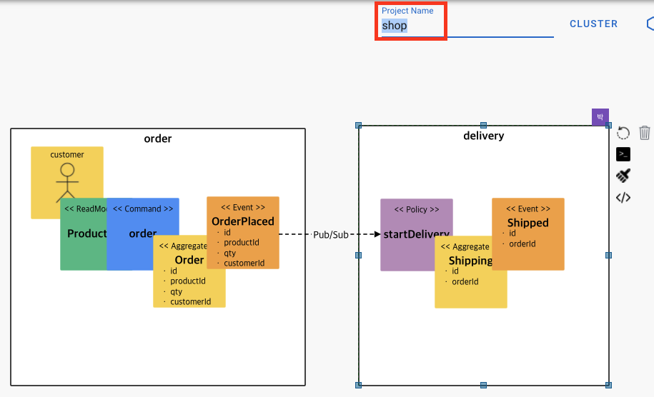

# Cloud IDE

## Screen composition and menu.

<h3>Full screen</h3>

- Basically, it is the same as the screen configuration of vcode.

>| Number | Explain               |
>|------|--------------------|
>|   1  | Project file area. |
>|   2  | Code writing area.    |
>|   3  | Terminal area.        |

>

<br>

<h3>메뉴 구성</h3>

### File

- The menu configuration of File is as follows.
  - New File: Add a new file
  - New Folder: Add a new folder
  - New Window: Launching a new IDE
  - Open...: Choose which one to open.
  - Open Workplace: Open your workspace
  - Open Recent Workplace: Open Recent Workplace
  - Save Workplace As...: Save workspace as a different name
  - Save: Save your work area
  - Save All: Save the entire workspace
  - Auto Save: Save Automatically
  - Upload Files...: Bring your own files
  - Download: Download your current job to my PC
  - Preferences: Various settings for an idea in use
  - Close Editor: Close Editor
  - Close Workplace: Close your workspace

>

<br>

### Edit

- configuration menu is as follows : edit
  - about to return once did : undo
  - delete (delete), which did on fast forward a look.
  - Cut selected area : cut
  - Copy the selection : copy
  - Paste : paste
  - copy path : path of radiation.
  - like f. + control windows : findSearch with search terms in the area.
  - to change : replace
  - find in files : finding files.
  - replace in files : change from a file.

>

<br>

### Selection

- The menu composition of Selection is as follows.
  - Select All: Choose All
  - Expand Selection: Expand Selection
  - Shrink Selection: Shrink Selection
  - Copy Line Up: Copy above the line
  - Move Line Up: Move to the top
  - Move Line Down: Move to the bottom
  - Duplicate Selection: Duplicate selections
  - Add Cursor Above: Add a point when it's big.
  - Add Cursor Bellow: Adding a point because it's bigger at the bottom.
  - Add Cutters to Line Ends: Add a cutter to the end of the line
  - Add Next Occurrence: Add the following items
  - Add Precious Occurrence: Add Previous Item
  - Select All Occurrence: Choose all the words located at the cursor point

>

<br>

### View

- The menu configuration of View is as follows.
  - Command Palette... Command Palette.
  - Open View: Open Available Items
  - Call Hierarchy: Call Layer
  - Debug: Error
  - Debug Console: Open Debug Console Window
  - Explorer: Find the current workspace file location
  - Extensions: Open plug-in window
  - Outline: Open and close the outline window.
  - OutPut: Open and close the lower terminal area
  - Plugins: Cursor Point Position Select all words
  - Probles: Open and close the bottom Probles area
  - References: References
  - Search: Complete search
  - Source Control: Go to Search Word Location
  - Test: Go to the bottom left flask icon area
  - Type Hierarchy: Tier Type
  - Toggle Bottom Panel: Switching the bottom panel
  - Toggle Statys Bar: Switching Statistics Bar
  - Collapse All Side Panels: Shrink all side panels
  - Toggle Word Wrap: Automatic line switching
  - Toggle Minimap: Minimap transition
  - Toggle Render Whitespace: Switching render spaces

>

<br>

### Go

- The menu configuration of GO is as follows.
  - Go Back: Backward winding
  - Go Forward: Winding forward
  - Last Edit Location: Edit Last Location
  - Go to File...: Go to File
  - Go to Symbol in Workplace...: Go to symbols in your workspace
  - Go to Symbol in Editor...: Go to Symbols in Editor
  - Go to Definition: Go to justice
  - GO to Declaration: Go to Declaration
  - Go to Type Definition: Go to Type Definition
  - Go to Implementation: Go to Implementation
  - Go to references: Go to references
  - Go to Line/Column...: Move to line/column
  - Go to Bracket: Move to Bracket
  - Next Problem: Next question
  - Precious Problem: Previous question

>

<br>

### Labs

- Labs' menu configuration is as follows.
  - New Terminal: Open a new terminal
  - Submit the results: The currently visible part of the terminal is captured and information on the ongoing practice is sent to the instructor.
  - Open Port: Localhost:8080 etc. is automatically opened to that port without having to open the address window directly.
  - Request Help: Like submitting results, if you leave the current error part on the terminal and click Request Help, the instructor will capture and send the terminal area.
  - Port Verification: You can check the port number you are currently using.
  - Docker Termination: Terminates the running docker.
  - Spring-boot Shutdown: Shutdown all running spring-boot servers
  - Start Kafka Server: Run Kafka Server
  - Start Zookeeper Server: Running the Jookeeper Server

>

<br>

- Run's menu configuration is as follows.
  - Start Debugging: Execute debug mode
  - Start Without Debugging: Start without debugging
  - Stop: Stopped running
  - Restart: Start again
  - Open Configurations: Open Configuration
  - Add Configuration...: Add Configuration
  - Toggle Breakpoint: Turning the breakpoint
  - New Breakpoint: New Breakpoint
  - Enable All Breakpoints: Use all breakpoints
  - Available All Breakpoints: Do not use all breakpoints
  - Remove All Breakpoints: Remove all breakpoints

>

<br>

- Terminal's menu configuration is as follows.
  - New Terminal: Open a new terminal
  - Split Terminal: Terminal Segmentation
  - Run Task...: Run the task.
  - Run Build Task: Run Build Task
  - Run Test Task: Run the test task
  - Run Last Task: Re-execute the last task
  - Show Running Tasks...: Show Running Tasks
  - Terminate Task...: End of work
  - Attach Task...: Connecting tasks
  - Configure Tasks...: Organize tasks

>

<br>

- Help's menu composition is as follows.
  - Getting Started: Opening the screen for the first time

>

## Icon

| Number | Icon | Explain                                                                            |
|------|--------|------------------------------------------------------------------------------------|
|   1  |  | You can check the current project.              |
|   2  |  | You can search in the entire area.                |
|   3  |  | Check the connected storage.                      |
|   4  |  | You can check debug and executable areas. |
|   5  |  | You can check the list of plug-ins available.  |
|   6  |  | You can check various test lists.           |

## Example of Cloud IDE practice

<iframe style="width:100%" height="315"" src="https://www.youtube.com/embed/KaEh7BbpDOw" title="YouTube video player" frameborder="0" allow="accelerometer; autoplay; clipboard-write; encrypted-media; gyroscope; picture-in-picture" allowfullscreen></iframe>

---

<br>

### Event storming.

**Click the Practice button at the top of the page to access the practice site.**

- After connecting, click the image or CREATE button of EventStorming.


<br>

**Draw an example event storming by dragging a sticker from the palette on the left.**

- For instructions on the tool, see the left menu -> Tool Usage -> Event Storming.


<br>

**Click Code Preview that pops up when you mouse over the CODE or CODE in the upper right corner.**

- You can check the code for the generated event storming.


<br>

**You can check after switching to various languages through the mode at the top right of the Code Preview window.**


<br>

### Use IDE

<br>

**Now, click Project ID after mouse over the CODE in the event storming window.**


<br>

**You can see that the IDE of the Web version appears like this.**
- Basically, environments such as docekr, kubernetes, and http are built into.
- If you have other tools you need, you can download them by downloading them from Linux.


<br>

- Docker


<br>

- Kubernetes


<br>

- Http


<br>


**Let's check if the message from the order service is normally registered on the Kafka server and a delivery console that acts as a consumer.**
- 1. Click Start Kafka Server in Labs on the top menu to run the Kafka server.
  - You can check the message that the Kafka server ran normally in the lower right corner.


<br>

- 2. Click Kafka Consumer in Labs on the top menu.


<br>

- 3. Topic's name is the same as the project name of event storming.


<br>

- 4. Click Kafka Consumer -> Write the Project Name with one space behind the generated command.


<br>

---

<br>

### Service execution.
**Move to the order's root to register the order service.**
- Run the spring boot server using the mvn spring-boot:run command.

```javascript
mvn spring-boot:run
```


<br>

- You can see that the order service appeared on port8081.


<br>

- Let me check at the new terminal to see if the order service is accessible.
- You can normally access the order service by applying the command below using http.
- We approached localhost:8081/orders because the path of src/main/java/project/orderRepository.java is the order and the order service is marked as port8081.
```javascript
http localhost:8081/orders
```


<br>

- If you put the values of customerId=1, qty=3, and productId=1 in the order, you can see that localhost:8081/orders contain the values normally.
```javascript
http localhost:8081/orders customerId=1 qty=3 productId=1
```


<br>

- When you place an order, you can see that the topic has been added where you executed the topic command.


