# EventStorming

<h2>MSA Development with MSA Easy</h2>

## 서비스 접속
[Pease navigate to the URL](http://www.msaez.io)
 (Chrome web browser is recommended.)

<h2>example project</h2>

The example project is the process of creating a Java Project running with Spring-boot by EventStoring two services, an order service and a delivery service, and automatically deploying them to Kubernetes in Google Cloud.

## UI Introduce

<h3>UI layout</h3>

Here's the full screen layout of the MSAEZ tool.

> 

| 번호 | 이름                | 기능 설명                                                        |
|------|---------------------|----------------------------------------------------------------- |
| 1    &nbsp;| Zoom Panel          | The ability to enlarge and reduce the screen created on the canvas |
| 2    &nbsp;| Project Name        | Enter the project name (Package name in case of Java)                         |
| 3    &nbsp;| Replay              | Ability to check modeling history information                             |
| 4    &nbsp;| Code                | Modeled code verification function                                         |
|ㆍ4-1 &nbsp;| Code Preview        | Modeled code download function                                     |
|ㆍ4-2 &nbsp;| Download Archive    | Function to practice modeled code                                    |
|ㆍ4-3 &nbsp;| Project IDE         | Function to check, download, and practice the modeled code                     |
| 5    &nbsp;| Save                | The Drawn EventStorming file is saved as a Json file                    |
|ㆍ5-1 &nbsp;| Save to Server      | A function to save the modeled sticker information to the server                    |
|ㆍ5-2 &nbsp;| Download model File | A function to save the modeled sticker information to my PC                  |
|ㆍ5-3 &nbsp;| Duplicate           | The function of replicating the modeled sticker information to the server                    |
| 6    &nbsp;| Share               | Simultaneous editing function through sharing modeling between users                         |
| 7    &nbsp;| Sticker Palette     | Palette with selectable sticky notes for EventStorming        |

### ·	Event Sticker
An orange icon in the sticker palette refers to an Event.

<h4>Event property setting</h4>

If you double-click the added Event sticker, the properties window appears as shown below on the right, and the values for each property setting are as follows.

> 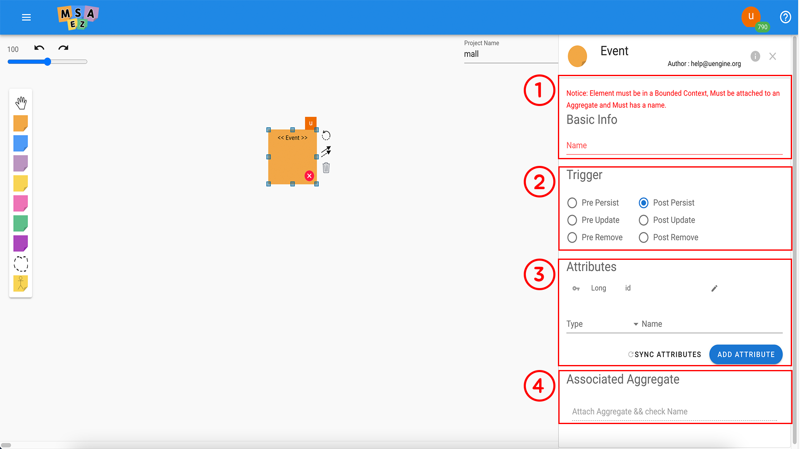

| Number | Name                 | Detail of fuction                            |
| ---- | -------------------- | ------------------------------------ |
| 1    | Event Name           | The name to be written on the Event Sticky note      |
| 2    | Trigger              | Trigger of the entity that raises the event  |
| 3    | Attribute            | Register Event Attributes             |
| 4    | Associated Aggregate | Select the aggregate to be associated with the event       |

According to the order scenario of the ordering team, fill in the following.

1. Enter “OrderPlaced” in Event Name.

2. Trigger select "PrePersist".

3. Attribute registers Entity to be used in Event.
Basically, if an aggregate is connected in step 4. below, refer to the entity information of the aggregate.

4. Select the aggregate to be connected. (After that, after adding the aggregate, select it.)

The delivery team creates an Event according to the delivery scenario.

1. Enter “DeliveryStarted” in the Event Name.

2. Trigger chooses PostUpdate.

3. Attribute registers Entity to be used in Event.
Basically, if an aggregate is connected in step 4. below, refer to the entity information of that aggregate.

4. Select the aggregate to be connected. (After that, after adding the aggregate, select it.)

### ·	Policy Sticker

Policy is indicated by a lilac colored icon in the sticker palette.

> 

<h4>Setting Policy Properties</h4>

If you double-click the added policy sticker, the properties window appears as shown below on the right, and the values for each property setting are as follows.

| Number | Name                   | Detail of fuction                       |
| ---- | ---------------------- | -------------------------------- |
| 1    | Policy Name            | Name to be written on Policy Sticky note |

Depending on the task at the time the event occurs, enter it as follows.

1.  Enter **StartDelivery** in Policy Name.

### ·	Command Sticker

Command is indicated by a blue icon in the sticker palette.

<h4>Command property setting</h4>

If you double-click the added Command sticker, the properties window appears as shown below on the right, and the values for each property setting are as follows.

> 

| Number | Name                     | Detail of fuction                 |
| ---- | -------------------------- | --------------------------------- |
| 1    | Command Name               | Name to be written on Command Sticky note |
| 2    | Restful Type               | Select CRUD Type of Restful API   |
| 3    | Associated Aggregate       | Select Aggregate to be associated with Command  |

Depending on the task at the time the event occurs, enter it as follows.

1. Enter **CreateOrder** in Command Name.

2. Restful Type is set to POST.

3. Select the aggregate to be linked. (After that, select after adding Aggregate.)

### ·	Aggregate Sticker

Aggregate is indicated by a yellow icon in the sticker palette

<h4>Set Aggregate Attributes</h4>

If you double-click the added Aggregate sticker, the properties window appears on the right as shown below, and the values for each property setting are as follows.

> 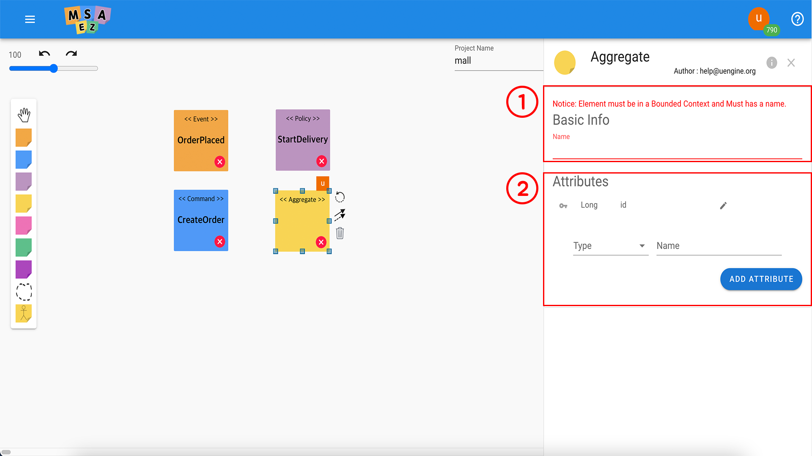

| Number | Name              | Detail of fuction                                   |
| ---- | ----------------- | ---------------------------------------------- |
| 1    | Aggregate Name    | Name to be written on Aggregate Sticky note           |
| 2    | Attributes        | Defines Aggregate Entity (Domain Entity). |

To define the Aggregate (Domain Entity) of the ordering service, write the following.

1. Enter **Order** in Aggregate Name.

2. Defines Aggregate Entity (Domain Entity).
The service adds an entity called Name whose Type is String.

To define the Aggregate (Domain Entity) of the shipping service, fill in the following.

1.  Enter **Delivery** in Aggregate Name.

2. Defines Aggregate Entity (Domain Entity).
In this service, an entity called Address whose Type is String is added.

If Aggregate is added, set the Associate Aggregate of each Event, Command, and Policy to designate the Aggregate.

### ·	Bounded Context Sticker

Bounded Context is indicated by the dotted line icon in the sticker palette.

<h4>Setting the Bounded Context property</h4>

> 

| Number | Name                   | Detail of fuction                     |
| ---- | ------------------------ | ----------------------------- |
| 1    | Bounded Context Name     | Name to be used for Bounded Context |

After drawing the Bounded Context of the ordering service and the Bounded Context of the delivery service,
Sticky Notes of EventStorming for each service
Drag & Drop to each Bounded Context.
 
After completing the tasks from 4.2.2 to 4.2.6 above, EventStorming results in the form below are displayed.

### ·	Relation

Relation refers to the line from the Event sticker to the Policy sticker.

<h4>Relation 추가</h4>

Select the arrow icon from the Event sticker, or just drag and drop it on the Policy sticker to be connected and then the connection will be established.

> 

<h4>Relation property setting</h4>

> 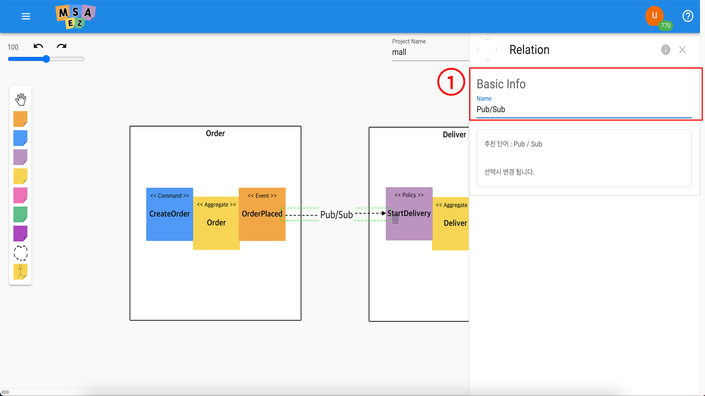

| Number | Name | Detail of fuction                                                                                                         |
| ---- | -----| --------------------------------------------------------------------------------------------------------------------------- |
| 1    | Type | Whether to use the event-driven Pub/Sub method, Or set whether to use the Request & Response Restful API method |

When an event of OrderPlaced of the ordering service occurs, StartDelivery is connected to start, and it sets how to start StartDelivery.

1.  It is set in Pub/Sub method of Event-Driven method.

<h4>EventStoring Results</h4>

When the above event storming is completed, it will appear as shown in the picture below.

> 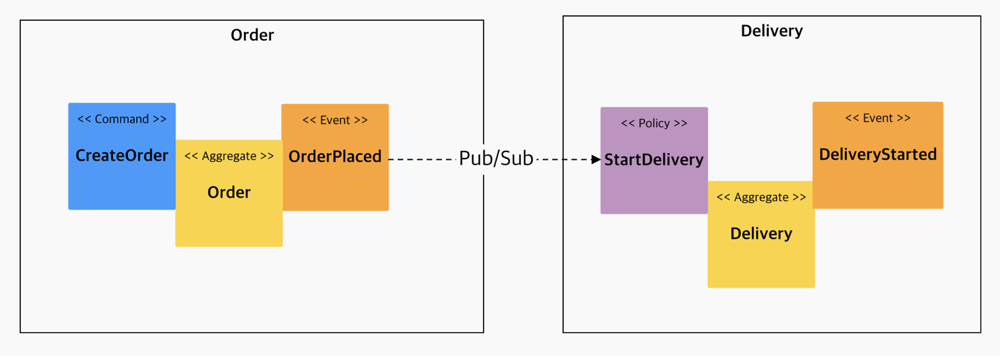

### ·	Code Preview

If you select Code Preview, you can check the result of EventStoring converted into Code through Code Preview.

<h4>Code preview layout</h4>

> 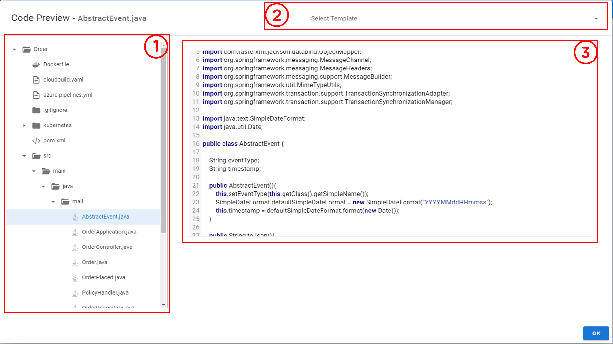

| Number | Name               | Detail of fuction                                                                   |
| -- | -------------------- | ------------------------------------------------------------------------------------ |
| 1  | Code List            | Displays the folder structure and files created according to the selected Template.                          |
| 2  | Select Template | Select which template from among the templates to generate code and check code  |
| 3  | Code View            | Displays the code of the selected file                                                    |

### ·	Download Archive

If you select Download Archive, you can select a template, and you can download the EventStoring result as a zip file.

> 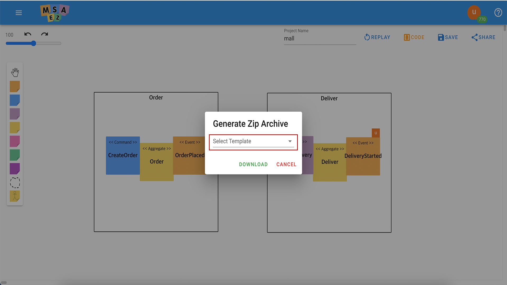

| Number | Name              | Detail of fuction                                                                            |
| ---- | ----------------- | ------------------------------------------------------------------------------------ |
| 1    | Select Template   | Select which template to generate and download the code using among the templates. |

## Build

### ·	Download file structure description

  - A project is created by the name (Order, Delivery) set in Bounded Context, and when the c-compression is unpacked, it has the following structure.

  - 

  - gateway is a provided template and shows how to configure spring-cloud-gateway. For normal use, you need to modify the routes part in the application.yaml file of gateway/src/main/resource and use it.

  - The file structure was created according to the basic template for each sticker as shown below. It is a spring-boot-based project and manages resources with maven.
If you want to change the file creation location or the basic contents of the file every time you create it, you can use the custom template in the next chapter.

> 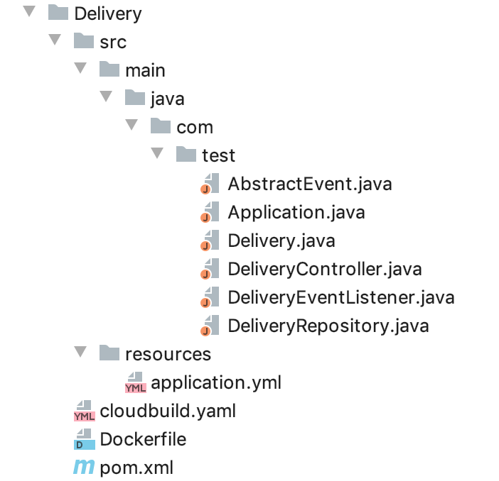

  - application.yaml
    
      - It is a configuration file of spring-boot, and the local environment variable and Docker environment variable are separated by profile setting.

    
      - Because it is event-based, the spring-cloud-stream library is used for message processing. Among them, the broker is set up using kafka.

  - Dockerfile   
      - This file is required when creating a Docker image.

      - When building with Docker, "--spring.profiles.active=docker" is set, so the profile set in the application.yaml file is read.

  - cloudbuild.yaml
    
      - This is a pipeline file used by Google Cloud Build.
    
      - By default, the test-build-docker build-publish-deploy step is set.
    
      - The Docker publish step deploys the image to Google Container Registry (GCR).
    
      - In the Deploy stage, you deploy to GKE. At this point, you need to set the cluster name and Zone. The following 3 items must be changed according to the user.
        
          - The substitutions._PROJECT_NAME: item determines which service and deploy name to deploy, and you need to change the corresponding part.
        
          - CLOUDSDK_COMPUTE_ZONE: The set Zone is set to Tokyo (asia-northeast1-a).
        
          - CLOUDSDK_CONTAINER_CLUSTER: The cluster name is standard-cluster-1, which is the default cluster name.

<h4>Prerequisites</h4>

  - maven install

  - run local kafka - localhost:9092

### ·	Execution

  - Since it is a Maven project, run it with mvn spring-boot:run .

  - If it runs normally, write localhost:8081 (port is different for each project, refer to the configuration file) in the browser to check whether the property values set in Aggregate are displayed normally at HATEOAS level.

  - Check if methods such as get and post written in Command are called successfully.

### ·	Cloud deployment

This guide shows how to automatically build and deploy the working source code by uploading it to github and creating a GCB trigger.

### ·	Git integration

  - GCB supports git repository, github, google code, and bitbucket so far. This guide explains how to put the code on github in two ways.

  - [https://github.com/](https://github.com/)
    Create a repository at

  - A repository is created and a git address is created.

  - Push the source to github by executing the script below in the project you want to upload to github.

  - git init

  - git commit –m ‘commit message’ .

  - git push \<github address\>

### ·	Create GCB Trigger

GCB trigger generation proceeds in the following order.

1. Enter the GCB menu of GCP and click the trigger menu.
> 
2. Click the Connect Repository button at the top.
> 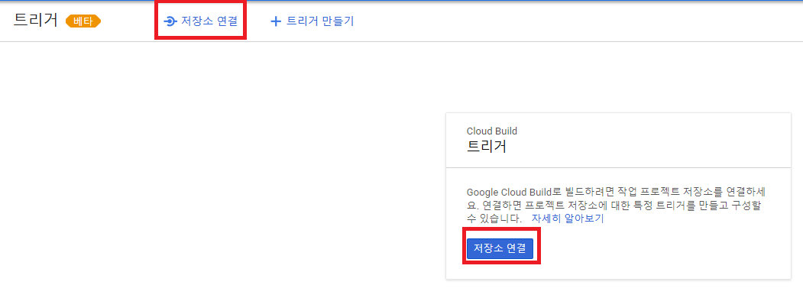
3. Select github in Connect Repository.
> 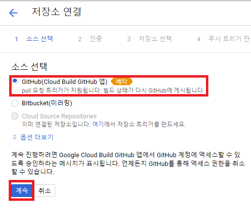
4. Proceed with github authentication.
> 
5. Finalize the repository connection by selecting the project to connect to.
> 
6. Click the Create Trigger button at the top to create a trigger.
> 
7. At the bottom of the trigger creation screen, choose CloudBuild as the build configuration.
>
8. Click the Create Trigger button to complete the trigger creation. Trigger execution can be done directly with the trigger execution button on the right. 
> 

If you create a trigger as above, you can check that the trigger works whenever you execute the push command on github.

### ·	Deploy Kubernetes

### ·	Check your Kubernetes deployment

  - If the trigger is executed without any issues, you can check the build success/failure in the history menu.

> 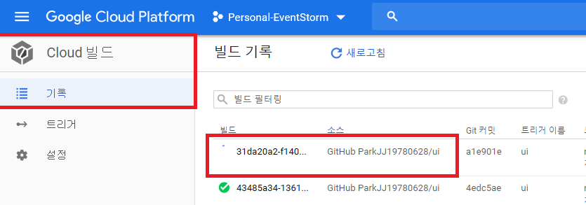

  - If a green success screen appears in the build history, it means that it has been successfully deployed to GKE. You can check the currently running services in the Workloads item of the GKE menu.

> 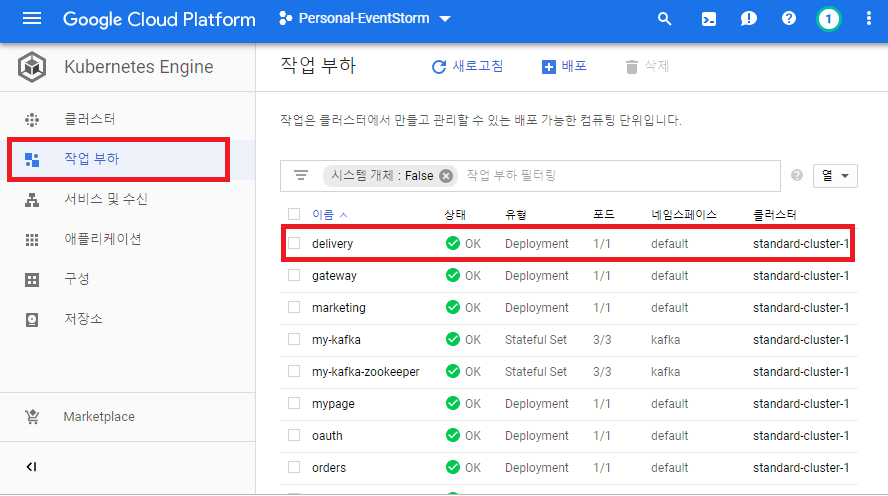

### ·	What to do when deployment fails

* n the case of build failure, build failure appears in red as shown below in the history item, and when clicked, it is possible to check in which step the error occurred. It can be resolved while checking the detailed log by clicking the log download button.

> 

> 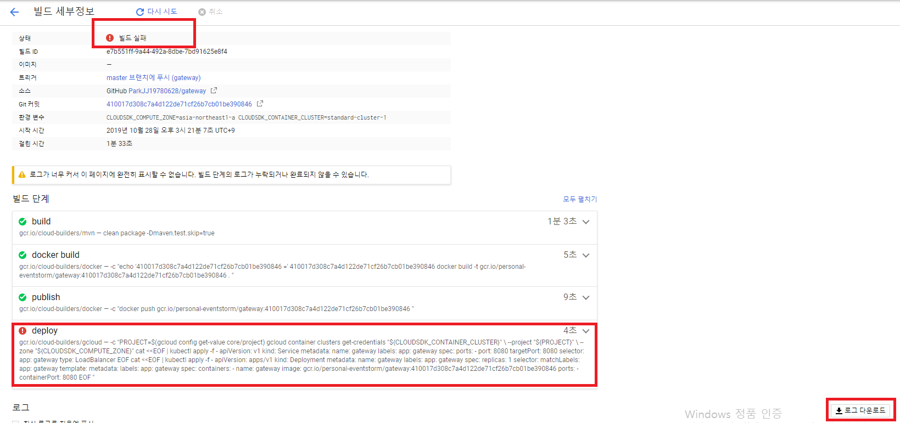

* If an error occurs in the deploy step, first check whether you have permission to deploy from GCB to GKE, and if not, set the permission.

> Cloud Build – In the Settings menu, check if the status is Kubernetes Engine Developer Enabled, and if not, enable it.

> 

* Verify that the name matches the cluster zone in the option part of the cloudBuild.yaml file.

<pre class=" language-yaml">

options :  
    env:  
    ## location/name of GKE cluster (used by all kubectl commands)  
    - CLOUDSDK_COMPUTE_ZONE=asia-northeast1-a  
    - CLOUDSDK_CONTAINER_CLUSTER=standard-cluster-1
    
</pre>
